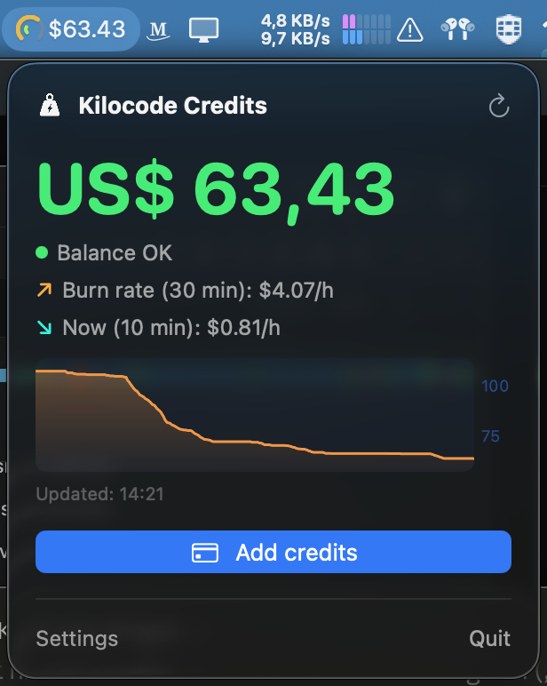
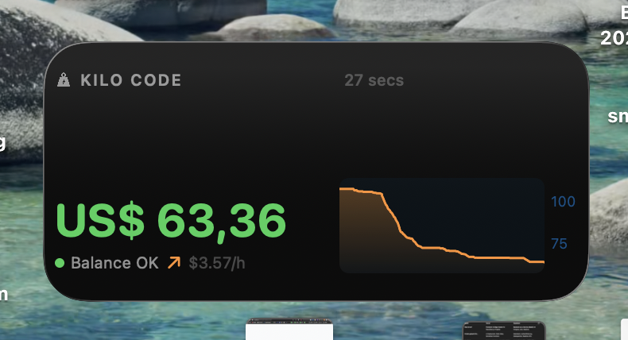
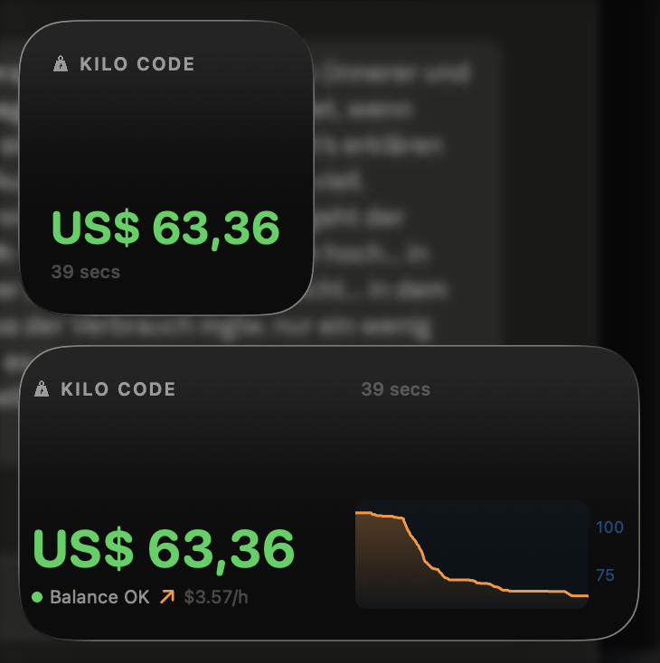
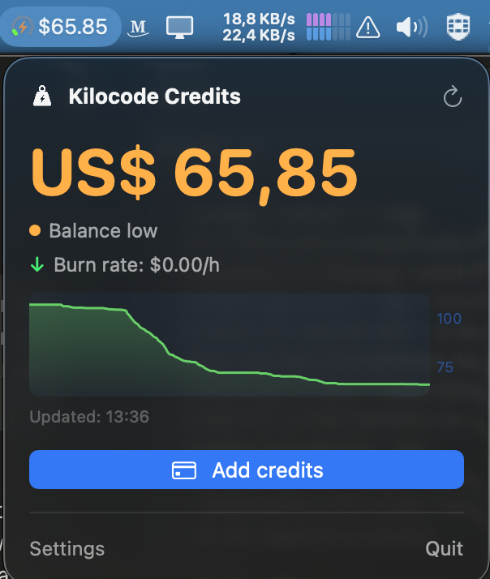
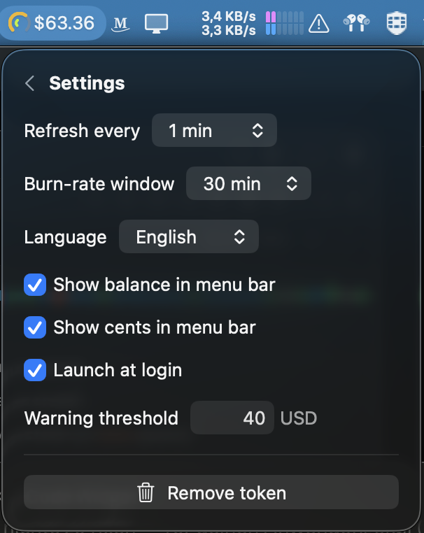

<p align="center">
  
</p>

<h1 align="center">Kilocode Credits for macOS</h1>

<p align="center">
A tiny menu bar app and desktop widget that shows your remaining
<a href="https://share.kilo.ai/mzUE5qu">Kilo Code</a> credit balance,
so you never run out of credits mid-session.
</p>

> **Unofficial.** This project is not affiliated with or endorsed by Kilo Code.
> The Kilo Code name belongs to its respective owners.

<p align="center">
  
</p>

## Features

- **Menu bar balance** - your current credit balance ($) right in the menu bar,
  with or without cents
- **Dual burn-rate tachometer** - the menu bar gauge has two arcs: the outer
  one averages your spending over a configurable window (5 min to 6 h), the
  inner one shows the instantaneous rate of the last 10 minutes - so a sudden
  full-throttle session is visible even while the long-term average still
  looks calm
- **Spike alarm** - when the 10-minute rate breaks out to 2.5x your window
  average (and at least $3/h), the inner arc pulses and you get a one-time
  macOS notification
- **History chart** - popover and medium widget show a stock-style chart of
  the last 6 hours, tinted by the current burn trend
- **Desktop & sidebar widget** - WidgetKit widget (small + medium) for the
  macOS Tahoe desktop widget gallery and Notification Center
- **Low-balance notifications** - one-time macOS notification when your balance
  drops below the warning threshold, and again when it gets critical
- **Auto-refresh** - configurable interval (1-60 min); the widget also
  refreshes on its own, even when the app is not running
- **One-click top-up** - opens [app.kilo.ai/profile](https://app.kilo.ai/profile)
  to buy credits
- **Browser sign-in** - uses Kilo's device-auth flow; no manual token copying
  (manual API key entry available as fallback)
- **Six languages** - English, Deutsch, Español, 中文, 日本語, Русский;
  live switching, defaults to your system language
- **Launch at login** - optional, via standard macOS login items

## Screenshots

| Desktop widget | Small + medium |
|---|---|
|  |  |

| Low balance | Settings |
|---|---|
|  |  |

## Reading the gauge

The menu bar icon is a tiny tachometer, like a car's rev counter:

- **Outer arc** - average burn rate over your configured window
  (*Settings → Burn-rate window*, 5 min to 6 h). Sweeps from green (idle)
  through yellow to red, full deflection at ~$10/h.
- **Inner arc** - instantaneous rate over the last 10 minutes. This is the
  "current fuel consumption" needle that catches expensive sessions
  immediately.
- **Pulsing inner arc** - spike alarm: right now you are burning at least
  2.5x your window average. A notification fires once per spike.
- **Pulsing bolt** - your balance dropped below the warning threshold
  (orange) or under $1 (red). This takes priority over the inner arc.
- **Weight mark** - shown while there is no burn data yet (fresh install).

## Install

There are no signed binaries yet, so you build from source (takes ~2 minutes):

### Requirements

- macOS 26 (Tahoe) or later
- Xcode 26+
- [XcodeGen](https://github.com/yonaskolb/XcodeGen): `brew install xcodegen`
- A free Apple Developer account (for local code signing)

### Build

```bash
git clone https://github.com/exocode/kilocode-credit-widget.git
cd kilocode-credit-widget
```

1. Open `project.yml` and replace `DEVELOPMENT_TEAM: RSH2E2EZUM` with your own
   team ID (Xcode → Settings → Accounts).
2. Replace the team ID prefix in both `.entitlements` files
   (`RSH2E2EZUM.com.janjezek.kilocodecredits`) with yours - the app group and
   keychain access group must start with your team ID.

```bash
xcodegen generate
xcodebuild -project KilocodeCredits.xcodeproj -scheme KilocodeCredits \
  -configuration Release -allowProvisioningUpdates build
```

3. Copy the built `KilocodeCredits.app` from
   `~/Library/Developer/Xcode/DerivedData/.../Build/Products/Release/`
   to `/Applications` and launch it. The app must live in `/Applications`
   for macOS to register the widget in the widget gallery.

### First run

1. Click the weight mark in the menu bar
2. **Sign in with browser** - approve the request on app.kilo.ai
3. Add the widget: right-click the desktop → *Edit Widgets* → *Kilocode Credits*

## How it works

- Balance comes from `GET https://api.kilo.ai/api/profile/balance`
  (Bearer token), the same endpoint the official VS Code extension uses
- Sign-in uses Kilo's device-auth flow
  (`POST /api/device-auth/codes`, then polling until you approve in the browser)
- The token is stored in the **macOS Keychain** (shared keychain access group),
  the last balance snapshot and history in an app group container so app and
  widget stay in sync
- No analytics, no third-party services - the app talks to `api.kilo.ai`
  and nothing else

Since the API is not officially documented, it may change without notice.
If the app suddenly shows errors, check for an updated version or open an issue.

## New to Kilo Code?

Kilo Code is an open-source AI coding agent for VS Code and JetBrains.
If you want to try it, you can use my referral link:

**[→ Get Kilo Code](https://share.kilo.ai/mzUE5qu)** *(referral link)*

## Support

If this little tool saves you from running dry mid-prompt, you can
[buy me a coffee](https://buymeacoffee.com/exocode). ☕

## License

MIT
